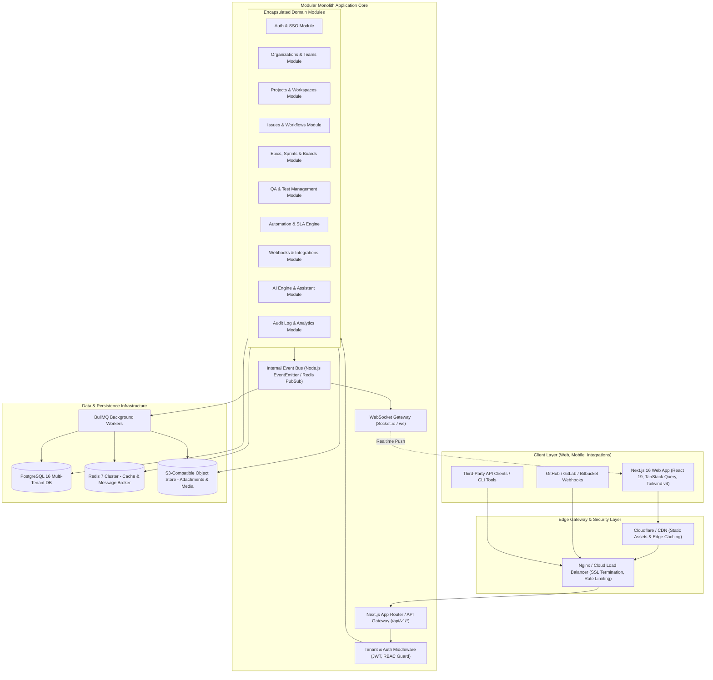
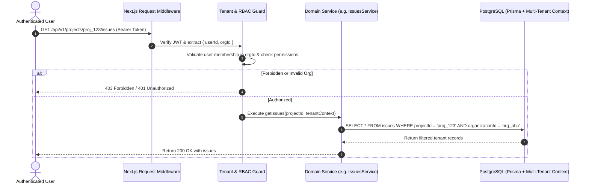
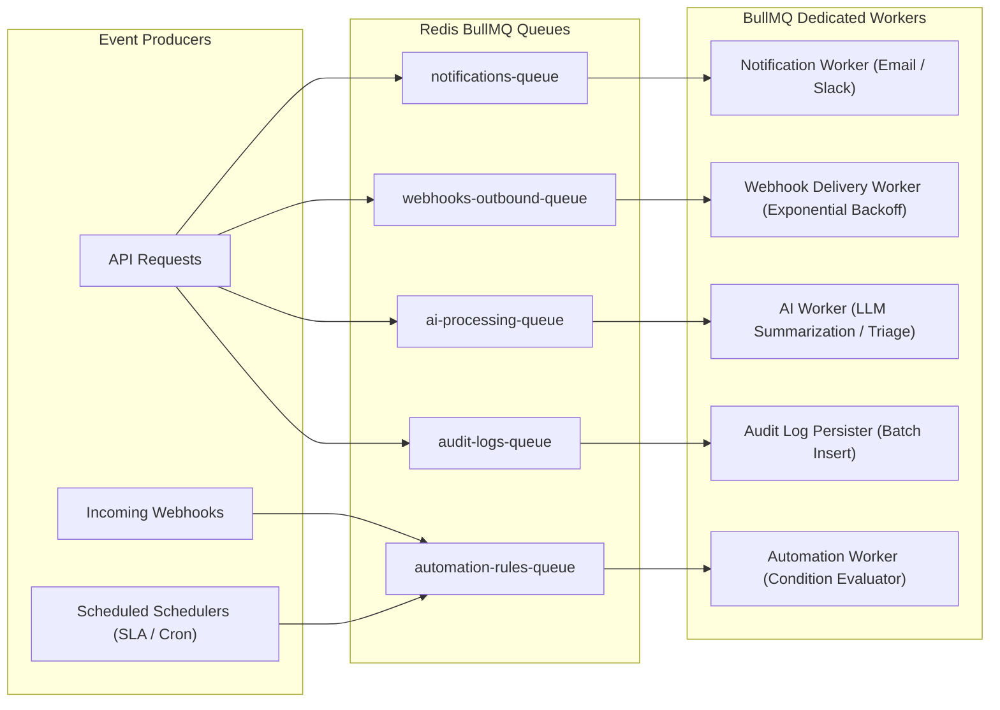

# Target System Architecture: Production-Grade Modular Monolith

**Project:** Enterprise AI-Powered Bug Tracker & Engineering Project Management SaaS  
**Document Version:** 1.0.0  
**Architectural Pattern:** Modular Monolith (Domain-Driven, Decoupled, Cloud-Native)  

---

## 1. Architectural Philosophy & Principles

To support thousands of organizations, millions of issues, and high concurrent engineering traffic without premature microservice complexity, the system is designed as an enterprise **Modular Monolith**.

### Core Tenets:
1. **Modular Monolith First**: All domain logic lives inside a unified, strongly-typed codebase with strictly enforced domain module boundaries. Modules communicate via typed interfaces and domain events, allowing any module to be extracted into a standalone microservice if horizontal scale demands it.
2. **Tenant Isolation as a Foundation**: Multi-tenancy is enforced at the database and data-access layer via an `organizationId` foreign key and tenant middleware context. Cross-tenant data leakage is architecturally impossible.
3. **API-First & OpenAPI Specified**: Every user interaction is backed by versioned RESTful API endpoints documented via OpenAPI 3.0 (Swagger), decoupling the frontend web client, mobile apps, and third-party webhooks.
4. **Resilient Asynchronous Processing**: Time-consuming tasks (AI processing, webhook delivery, email notifications, audit logging, metric aggregations) are offloaded to background workers via Redis and BullMQ.
5. **Real-time Event Streaming**: Critical user updates (board movements, comment alerts, status changes) are pushed via WebSockets rather than polling.
6. **Defense in Depth**: Zero-trust internal security, RBAC policies, input sanitization via Zod, rate limiting at edge gateways, and immutable audit logs.

---

## 2. High-Level Architecture Diagram



---

## 3. Technology Stack Specification

| Component | Selected Technology | Technical Justification |
| :--- | :--- | :--- |
| **Frontend Framework** | **Next.js 16 (App Router) + React 19** | Server-side rendering for executive views, fast hydration, layout nesting, modern React Actions, and edge middleware capabilities. |
| **Language & Typings** | **TypeScript 5.x (Strict Mode)** | Full end-to-end type safety across client, server DTOs, and database models. |
| **Styling & Design System** | **Tailwind CSS v4 + Radix UI Primitives** | Modern CSS variable tokens, responsive dark mode, accessible dialogs/menus, and zero-runtime CSS overhead. |
| **Client State & Cache** | **TanStack Query v5 (React Query)** | Automatic background re-fetching, cache invalidation, window focus synchronization, and optimistic UI updates for Kanban boards. |
| **Forms & Validation** | **React Hook Form + Zod** | Controlled/uncontrolled form performance with strict runtime schema validation shared between client and server. |
| **Backend Architecture** | **Modular Monolith (Next.js API + Node Service Layer)** | Single-repository simplicity with domain separation: services, controllers, DTOs, and repositories isolated by domain folders. |
| **Database & ORM** | **PostgreSQL 16 + Prisma ORM 5.22+** | ACID compliance, JSONB support for custom fields, row-level indexing, connection pooling, and declarative schema migrations. |
| **Cache & Real-Time Broker** | **Redis 7 (Standalone / Cluster)** | Sub-millisecond session caching, distributed locks, rate limiting counters, and pub/sub message bus. |
| **Background Processing** | **BullMQ 5.x** | Enterprise-grade job queues for webhook retries, automated SLA monitoring, email notifications, and asynchronous AI tasks. |
| **Object Storage** | **S3-Compatible Storage (AWS S3 / MinIO / R2)** | Secure, pre-signed URL uploads for defect screenshots, screen recordings, crash logs, and attachments. |
| **API Documentation** | **OpenAPI 3.0 / Swagger UI** | Interactive API exploration, SDK generation for third parties, and automated schema synchronization. |
| **Realtime Engine** | **WebSockets (Socket.io / ws server)** | Bi-directional streaming for live board updates, concurrent editing alerts, and notification badges. |

---

## 4. Comprehensive 30-Module Domain Specification

The backend domain architecture is cleanly organized into **30 autonomous modules**, each adhering to single-responsibility principles and strict interface boundaries:

```
src/modules/
├── auth/                 # 1. Authentication, Sessions, SSO, Credentials
├── organizations/        # 2. Multi-tenancy, Orgs, Slugs, Workspaces
├── users/                # 3. User Profiles, Identities, Avatars, Settings
├── teams/                # 4. Functional squads, Team Lead assignments
├── rbac/                 # 5. Roles, Permissions, Access Control Policies
├── projects/             # 6. Projects, Keys, Categories, Archival
├── issues/               # 7. Bug Tracking, Defect Lifecycle, Hierarchy
├── comments/             # 8. Discussion threads, Markdown, Mentions
├── attachments/          # 9. S3 object storage adapters, Presigned URLs
├── epics/                # 10. Strategic initiatives, High-level milestones
├── sprints/              # 11. Iteration cycles, Story points, Burndown
├── boards/               # 12. Kanban & Scrum boards, Column ordering
├── backlog/              # 13. Unscheduled issue backlog, Sprint planning
├── roadmaps/             # 14. Timeline visualization, Gantt dependency views
├── releases/             # 15. Version releases, Changelogs, Deployment tags
├── workflows/            # 16. State machine, Status transitions, Guards
├── custom-fields/        # 17. Dynamic project fields (JSONB engine)
├── automation/           # 18. Trigger-Condition-Action no-code engine
├── time-tracking/        # 19. Worklogs, Estimates, Billable hours
├── sla/                  # 20. SLA policies, Breach timers, Alerts
├── qa/                   # 21. Test suites, Test cases, Test runs, Bug linking
├── reports/              # 22. Velocity, Burndown, Defect distribution
├── analytics/            # 23. Aggregated SQL KPI calculations, Dashboards
├── integrations/         # 24. GitHub, GitLab, Bitbucket sync
├── webhooks/             # 25. Inbound receiver & Outbound dispatcher
├── api-keys/             # 26. Third-party developer API keys & Scopes
├── audit/                # 27. Tamper-evident mutation logs
├── knowledge-base/       # 28. Documentation articles, Project wikis
├── customer-requests/    # 29. External support tickets, Triage queue
└── ai/                   # 30. LLM defect triage, Duplicate detection, AI assistant
```

### Module Boundary Invariants:
1. **Zero Direct Cross-Domain SQL:** Module A never directly queries Module B's database tables. It accesses data through Module B's exported public service or listens to domain events.
2. **Standardized DTO Validation:** All incoming data into a module is validated via Zod schemas.
3. **Domain Event Broadcasting:** Key mutations emit asynchronous events (e.g. `issue.status_changed`, `member.invited`, `sla.breached`) consumed by notification, automation, and audit listeners.

---

## 5. Multi-Tenancy & Data Isolation Model

Logical multi-tenancy is enforced using **Shared Database with Column-Level Isolation**:



### Isolation Enforcement Layers:
1. **Middleware Level:** Validates the active organization membership from JWT claims or session cookies.
2. **Service Level:** All service method signatures require a validated `TenantContext` parameter.
3. **Prisma Client Extension Level:** A Prisma extension automatically injects `where: { organizationId: context.organizationId }` into all queries on tenant-scoped tables.

---

## 6. Real-Time Collaboration & WebSockets

1. **Room Partitioning:** Socket rooms are scoped strictly by organization and project:
   - `org:{orgId}:project:{projectId}`
   - `issue:{issueId}`
2. **Optimistic Updates & Conflict Avoidance:**
   - Kanban card drag-and-drop operations trigger immediate optimistic UI state transitions on the client.
   - The backend validates the transition against the workflow state machine, commits to PostgreSQL, and broadcasts `issue:updated` to room participants.
3. **Presence Indicators:** WebSockets broadcast active viewers and editors (`user:viewing_issue`) to prevent concurrent overwrite collisions.

---

## 7. Background Worker & Queue Topology (BullMQ + Redis)



---

## 8. Scalability & Extensibility Roadmap

1. **Read Replicas:** Configure PostgreSQL read replicas for heavy analytics, reports, and search queries.
2. **Table Partitioning:** Partition `audit_logs` and `webhook_deliveries` tables by month using PostgreSQL declarative partitioning.
3. **Dedicated Search Index:** Transition from PostgreSQL full-text search (`tsvector`) to Meilisearch / Elasticsearch once issue count crosses 1,000,000.
4. **Service Extraction:** When specific modules (e.g., `ai` or `webhooks`) require independent scaling, their self-contained domain structure allows extraction into standalone containers without schema rewrites.
