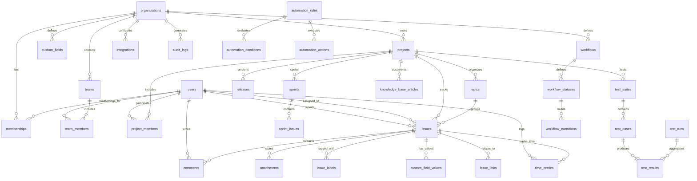

# Enterprise Database Plan & Data Architecture

**Project:** Enterprise AI-Powered Bug Tracker & Engineering Project Management SaaS  
**Target Engine:** PostgreSQL 16+  
**ORM / Migration Engine:** Prisma ORM 5.22+ with Declarative Migrations  
**Document Version:** 1.0.0  

---

## 1. Data Modeling Philosophy & Standards

To support millions of issues, thousands of organizations, strict tenant isolation, and audit compliance, the database schema follows these enterprise architectural standards:

1. **Deterministic Primary Keys**: Primary keys use `CUID2` or `UUIDv7` (collision-resistant, time-ordered, index-friendly for B-trees).
2. **Strict Multi-Tenant Isolation**: Every tenant-scoped entity contains an indexed `organizationId` foreign key referencing `organizations(id) ON DELETE CASCADE`.
3. **Comprehensive Composite Indexing**: All queries filtered by tenant and status/assignee/created_at must hit a composite index (e.g., `[organizationId, projectId, status]`).
4. **Soft Deletion Strategy**: Critical domain records (`organizations`, `projects`, `issues`, `comments`, `test_cases`) use a `deletedAt TIMESTAMPTZ` column. Queries filter active records via partial indexes (`WHERE deleted_at IS NULL`).
5. **JSONB for Dynamic Extensibility**: Used for custom field values, workflow transition rules, automation payloads, and webhook delivery logs without requiring schema alterations.
6. **Immutable Audit Trails**: Mutation tables (`audit_logs`, `webhook_deliveries`) are append-only.

---

## 2. Entity Relationship Overview



---

## 3. Comprehensive Entity Dictionary (All 40 Entities)

### 3.1 Organization, Multi-Tenancy & Identity

#### 1. `organizations`
Top-level multi-tenant boundary representing a company, enterprise, or team workspace.
- `id`: `String` (PK, CUID2)
- `name`: `String` (e.g. "Acme Corp")
- `slug`: `String` (UNIQUE, e.g. "acme-corp")
- `logoUrl`: `String?`
- `plan`: `String` (DEFAULT 'FREE', 'PRO', 'ENTERPRISE')
- `settings`: `Json` (DEFAULT '{}', security policies, SSO configs)
- `createdAt`: `DateTime` (DEFAULT `now()`)
- `updatedAt`: `DateTime` (`@updatedAt`)
- `deletedAt`: `DateTime?`
- **Indexes**: `@@unique([slug])`, `@@index([deletedAt])`

#### 2. `users`
Global identity record for authenticated individuals.
- `id`: `String` (PK, CUID2)
- `email`: `String` (UNIQUE)
- `emailVerified`: `DateTime?`
- `name`: `String?`
- `passwordHash`: `String?` (bcrypt / Argon2id)
- `avatarUrl`: `String?`
- `jobTitle`: `String?`
- `isActive`: `Boolean` (DEFAULT true)
- `createdAt`: `DateTime` (DEFAULT `now()`)
- `updatedAt`: `DateTime` (`@updatedAt`)
- **Indexes**: `@@unique([email])`

#### 3. `memberships`
Join table connecting Users to Organizations with organizational roles.
- `id`: `String` (PK, CUID2)
- `organizationId`: `String` (FK -> `organizations.id` ON DELETE CASCADE)
- `userId`: `String` (FK -> `users.id` ON DELETE CASCADE)
- `role`: `String` (DEFAULT 'MEMBER', 'OWNER', 'ADMIN', 'MEMBER', 'GUEST')
- `joinedAt`: `DateTime` (DEFAULT `now()`)
- `updatedAt`: `DateTime` (`@updatedAt`)
- **Indexes**: `@@unique([organizationId, userId])`, `@@index([userId])`, `@@index([organizationId])`

#### 4. `teams`
Functional engineering squads (e.g. "Core Engine", "QA & Automation", "Frontend").
- `id`: `String` (PK, CUID2)
- `organizationId`: `String` (FK -> `organizations.id` ON DELETE CASCADE)
- `name`: `String`
- `description`: `String?`
- `leadUserId`: `String?` (FK -> `users.id`)
- `createdAt`: `DateTime` (DEFAULT `now()`)
- `updatedAt`: `DateTime` (`@updatedAt`)
- **Indexes**: `@@index([organizationId])`

#### 5. `team_members`
Mapping of users to functional squads.
- `id`: `String` (PK, CUID2)
- `teamId`: `String` (FK -> `teams.id` ON DELETE CASCADE)
- `userId`: `String` (FK -> `users.id` ON DELETE CASCADE)
- `role`: `String` (DEFAULT 'MEMBER', 'LEAD')
- `createdAt`: `DateTime` (DEFAULT `now()`)
- **Indexes**: `@@unique([teamId, userId])`, `@@index([userId])`

---

### 3.2 Projects & Project Workspaces

#### 6. `projects`
Isolated engineering workspace for tracking issues, sprints, and releases.
- `id`: `String` (PK, CUID2)
- `organizationId`: `String` (FK -> `organizations.id` ON DELETE CASCADE)
- `name`: `String`
- `key`: `String` (Project prefix, e.g. "CORE", "CLOUD")
- `description`: `String?`
- `leadUserId`: `String?` (FK -> `users.id`)
- `category`: `String` (DEFAULT 'Software')
- `status`: `String` (DEFAULT 'ACTIVE', 'ARCHIVED')
- `createdAt`: `DateTime` (DEFAULT `now()`)
- `updatedAt`: `DateTime` (`@updatedAt`)
- `deletedAt`: `DateTime?`
- **Indexes**: `@@unique([organizationId, key])`, `@@index([organizationId, status])`, `@@index([deletedAt])`

#### 7. `project_members`
Project-level role assignment (restricts access to specific projects).
- `id`: `String` (PK, CUID2)
- `projectId`: `String` (FK -> `projects.id` ON DELETE CASCADE)
- `userId`: `String` (FK -> `users.id` ON DELETE CASCADE)
- `projectRole`: `String` (DEFAULT 'CONTRIBUTOR', 'MANAGER', 'VIEWER')
- **Indexes**: `@@unique([projectId, userId])`, `@@index([userId])`

---

### 3.3 Issues, Defect Tracking & Hierarchy

#### 8. `issue_types`
Configurable issue classifications (Bug, Feature, Task, Epic, Story, Subtask).
- `id`: `String` (PK, CUID2)
- `organizationId`: `String` (FK -> `organizations.id`)
- `name`: `String` ("Bug", "Feature", "Task", "Story")
- `icon`: `String`
- `color`: `String`
- `isDefault`: `Boolean` (DEFAULT false)
- **Indexes**: `@@index([organizationId])`

#### 9. `issue_statuses`
Status categories for issue progression.
- `id`: `String` (PK, CUID2)
- `organizationId`: `String` (FK -> `organizations.id`)
- `name`: `String` ("Open", "In Progress", "In Review", "Resolved", "Closed")
- `category`: `String` ('TODO', 'IN_PROGRESS', 'DONE')
- `color`: `String`
- `position`: `Int` (Ordering index)
- **Indexes**: `@@index([organizationId, position])`

#### 10. `issue_priorities`
Priority classifications.
- `id`: `String` (PK, CUID2)
- `organizationId`: `String` (FK -> `organizations.id`)
- `name`: `String` ("Urgent", "High", "Medium", "Low")
- `level`: `Int` (1=Urgent, 4=Low)
- `color`: `String`
- **Indexes**: `@@index([organizationId, level])`

#### 11. `issues`
The central transactional entity representing defects, tasks, stories, and tickets.
- `id`: `String` (PK, CUID2)
- `organizationId`: `String` (FK -> `organizations.id` ON DELETE CASCADE)
- `projectId`: `String` (FK -> `projects.id` ON DELETE CASCADE)
- `key`: `String` (e.g. "CORE-104")
- `sequenceNumber`: `Int` (Sequential number within project)
- `title`: `String`
- `description`: `String?` (Markdown / Structured JSON)
- `issueTypeId`: `String?` (FK -> `issue_types.id`)
- `statusId`: `String?` (FK -> `issue_statuses.id`)
- `status`: `String` (DEFAULT 'OPEN', fallback string)
- `priorityId`: `String?` (FK -> `issue_priorities.id`)
- `priority`: `String` (DEFAULT 'MEDIUM')
- `severity`: `String` (DEFAULT 'MODERATE', 'CRITICAL', 'MAJOR', 'MODERATE', 'MINOR')
- `module`: `String` (DEFAULT 'General')
- `reproducibility`: `String` (DEFAULT 'Always')
- `environment`: `String` (DEFAULT 'Production')
- `assigneeId`: `String?` (FK -> `users.id` ON DELETE SET NULL)
- `reporterId`: `String?` (FK -> `users.id` ON DELETE SET NULL)
- `epicId`: `String?` (FK -> `epics.id` ON DELETE SET NULL)
- `parentIssueId`: `String?` (FK -> `issues.id` ON DELETE SET NULL, for subtasks)
- `storyPoints`: `Int?`
- `originalEstimateMinutes`: `Int?`
- `remainingEstimateMinutes`: `Int?`
- `dueDate`: `DateTime?`
- `resolvedAt`: `DateTime?`
- `createdAt`: `DateTime` (DEFAULT `now()`)
- `updatedAt`: `DateTime` (`@updatedAt`)
- `deletedAt`: `DateTime?`
- **Composite Indexes**:
  - `@@unique([projectId, sequenceNumber])`
  - `@@unique([organizationId, key])`
  - `@@index([organizationId, projectId, status])`
  - `@@index([organizationId, assigneeId])`
  - `@@index([organizationId, reporterId])`
  - `@@index([projectId, createdAt(sort: Desc)])`
  - `@@index([parentIssueId])`
  - `@@index([epicId])`

#### 12. `comments`
Discussion messages and audit remarks on issues.
- `id`: `String` (PK, CUID2)
- `organizationId`: `String` (FK -> `organizations.id` ON DELETE CASCADE)
- `issueId`: `String` (FK -> `issues.id` ON DELETE CASCADE)
- `authorId`: `String` (FK -> `users.id` ON DELETE CASCADE)
- `content`: `String` (Markdown)
- `isInternal`: `Boolean` (DEFAULT false)
- `createdAt`: `DateTime` (DEFAULT `now()`)
- `updatedAt`: `DateTime` (`@updatedAt`)
- `deletedAt`: `DateTime?`
- **Indexes**: `@@index([issueId, createdAt(sort: Asc)])`

#### 13. `attachments`
Object storage metadata for uploaded files, images, logs, and screenshots.
- `id`: `String` (PK, CUID2)
- `organizationId`: `String` (FK -> `organizations.id` ON DELETE CASCADE)
- `issueId`: `String?` (FK -> `issues.id` ON DELETE CASCADE)
- `commentId`: `String?` (FK -> `comments.id` ON DELETE CASCADE)
- `uploaderId`: `String` (FK -> `users.id`)
- `fileName`: `String`
- `fileSize`: `Int` (bytes)
- `fileType`: `String` (MIME type)
- `s3Key`: `String`
- `s3Bucket`: `String`
- `createdAt`: `DateTime` (DEFAULT `now()`)
- **Indexes**: `@@index([issueId])`, `@@index([organizationId])`

#### 14. `labels`
Reusable tags within an organization.
- `id`: `String` (PK, CUID2)
- `organizationId`: `String` (FK -> `organizations.id` ON DELETE CASCADE)
- `name`: `String`
- `color`: `String`
- `description`: `String?`
- **Indexes**: `@@unique([organizationId, name])`

#### 15. `issue_labels`
Join table connecting issues to labels.
- `id`: `String` (PK, CUID2)
- `issueId`: `String` (FK -> `issues.id` ON DELETE CASCADE)
- `labelId`: `String` (FK -> `labels.id` ON DELETE CASCADE)
- **Indexes**: `@@unique([issueId, labelId])`, `@@index([labelId])`

---

### 3.4 Agile, Sprints, Epics & Releases

#### 16. `epics`
High-level strategic initiatives grouping stories and defects.
- `id`: `String` (PK, CUID2)
- `organizationId`: `String` (FK -> `organizations.id`)
- `projectId`: `String` (FK -> `projects.id`)
- `key`: `String` (e.g. "CORE-E1")
- `name`: `String`
- `summary`: `String?`
- `color`: `String`
- `startDate`: `DateTime?`
- `targetDate`: `DateTime?`
- `status`: `String` ('PLANNED', 'IN_PROGRESS', 'COMPLETED')
- **Indexes**: `@@index([projectId, status])`

#### 17. `sprints`
Time-boxed iteration cycles for Scrum planning.
- `id`: `String` (PK, CUID2)
- `projectId`: `String` (FK -> `projects.id` ON DELETE CASCADE)
- `name`: `String` ("Sprint 14")
- `goal`: `String?`
- `startDate`: `DateTime`
- `endDate`: `DateTime`
- `status`: `String` ('PLANNED', 'ACTIVE', 'COMPLETED')
- `velocityPoints`: `Int?`
- `completedAt`: `DateTime?`
- **Indexes**: `@@index([projectId, status])`

#### 18. `sprint_issues`
Issues assigned to a sprint iteration.
- `id`: `String` (PK, CUID2)
- `sprintId`: `String` (FK -> `sprints.id` ON DELETE CASCADE)
- `issueId`: `String` (FK -> `issues.id` ON DELETE CASCADE)
- `addedAt`: `DateTime` (DEFAULT `now()`)
- `completedInSprint`: `Boolean` (DEFAULT false)
- **Indexes**: `@@unique([sprintId, issueId])`

#### 19. `releases`
Software version milestones (e.g., "v2.4.0 Production").
- `id`: `String` (PK, CUID2)
- `projectId`: `String` (FK -> `projects.id` ON DELETE CASCADE)
- `name`: `String`
- `version`: `String`
- `description`: `String?`
- `releaseDate`: `DateTime?`
- `status`: `String` ('UNRELEASED', 'RELEASED', 'ARCHIVED')
- **Indexes**: `@@index([projectId, status])`

---

### 3.5 Workflows, Custom Fields & Dependencies

#### 20. `workflows`
Configurable finite-state machines defining issue lifecycles.
- `id`: `String` (PK, CUID2)
- `organizationId`: `String` (FK -> `organizations.id`)
- `name`: `String`
- `isDefault`: `Boolean` (DEFAULT false)
- **Indexes**: `@@index([organizationId])`

#### 21. `workflow_statuses`
Mapping of statuses included in a specific workflow.
- `id`: `String` (PK, CUID2)
- `workflowId`: `String` (FK -> `workflows.id` ON DELETE CASCADE)
- `statusId`: `String` (FK -> `issue_statuses.id`)
- `position`: `Int`
- **Indexes**: `@@unique([workflowId, statusId])`

#### 22. `workflow_transitions`
Permitted status transitions with permission constraints.
- `id`: `String` (PK, CUID2)
- `workflowId`: `String` (FK -> `workflows.id` ON DELETE CASCADE)
- `fromStatusId`: `String` (FK -> `issue_statuses.id`)
- `toStatusId`: `String` (FK -> `issue_statuses.id`)
- `name`: `String`
- `requiredRoles`: `String[]`
- `conditions`: `Json` (DEFAULT '{}')
- **Indexes**: `@@index([workflowId, fromStatusId])`

#### 23. `custom_fields`
Custom field definitions per organization or project.
- `id`: `String` (PK, CUID2)
- `organizationId`: `String` (FK -> `organizations.id` ON DELETE CASCADE)
- `projectId`: `String?` (FK -> `projects.id` ON DELETE CASCADE)
- `name`: `String`
- `fieldType`: `String` ('STRING', 'NUMBER', 'DROPDOWN', 'DATE', 'BOOLEAN', 'USER')
- `options`: `Json?`
- `isRequired`: `Boolean` (DEFAULT false)
- **Indexes**: `@@index([organizationId])`

#### 24. `custom_field_values`
Stored custom field values for specific issues.
- `id`: `String` (PK, CUID2)
- `issueId`: `String` (FK -> `issues.id` ON DELETE CASCADE)
- `customFieldId`: `String` (FK -> `custom_fields.id` ON DELETE CASCADE)
- `valueString`: `String?`
- `valueNumber`: `Float?`
- `valueDate`: `DateTime?`
- `valueJson`: `Json?`
- **Indexes**: `@@unique([issueId, customFieldId])`, `@@index([customFieldId])`

#### 25. `issue_links`
Directional issue associations (e.g. "relates to", "duplicates").
- `id`: `String` (PK, CUID2)
- `sourceIssueId`: `String` (FK -> `issues.id` ON DELETE CASCADE)
- `targetIssueId`: `String` (FK -> `issues.id` ON DELETE CASCADE)
- `relationshipType`: `String` ('RELATES_TO', 'DUPLICATES', 'CLONES')
- **Indexes**: `@@unique([sourceIssueId, targetIssueId, relationshipType])`

#### 26. `dependencies`
Blocking dependency graphs for Gantt and timeline views.
- `id`: `String` (PK, CUID2)
- `blockingIssueId`: `String` (FK -> `issues.id` ON DELETE CASCADE)
- `blockedIssueId`: `String` (FK -> `issues.id` ON DELETE CASCADE)
- `createdAt`: `DateTime` (DEFAULT `now()`)
- **Indexes**: `@@unique([blockingIssueId, blockedIssueId])`

---

### 3.6 Time Tracking, Notifications & SLA

#### 27. `time_entries`
Logged work time entries on issues.
- `id`: `String` (PK, CUID2)
- `issueId`: `String` (FK -> `issues.id` ON DELETE CASCADE)
- `userId`: `String` (FK -> `users.id`)
- `durationMinutes`: `Int`
- `description`: `String?`
- `workDate`: `DateTime`
- **Indexes**: `@@index([issueId, workDate])`, `@@index([userId, workDate])`

#### 28. `notifications`
In-app notification feed entries.
- `id`: `String` (PK, CUID2)
- `userId`: `String` (FK -> `users.id` ON DELETE CASCADE)
- `organizationId`: `String` (FK -> `organizations.id` ON DELETE CASCADE)
- `type`: `String` ('MENTION', 'ASSIGNED', 'STATUS_CHANGE', 'SLA_BREACH')
- `title`: `String`
- `message`: `String`
- `resourceType`: `String`
- `resourceId`: `String`
- `isRead`: `Boolean` (DEFAULT false)
- `createdAt`: `DateTime` (DEFAULT `now()`)
- **Indexes**: `@@index([userId, isRead, createdAt(sort: Desc)])`

#### 29. `notification_preferences`
User channel delivery preferences.
- `id`: `String` (PK, CUID2)
- `userId`: `String` (FK -> `users.id` ON DELETE CASCADE)
- `channel`: `String` ('IN_APP', 'EMAIL', 'SLACK')
- `eventType`: `String`
- `enabled`: `Boolean` (DEFAULT true)
- **Indexes**: `@@unique([userId, channel, eventType])`

---

### 3.7 Automation Engine

#### 30. `automation_rules`
No-code event trigger definitions.
- `id`: `String` (PK, CUID2)
- `projectId`: `String` (FK -> `projects.id` ON DELETE CASCADE)
- `name`: `String`
- `triggerType`: `String` ('ISSUE_CREATED', 'STATUS_CHANGED', 'SLA_BREACHED')
- `isEnabled`: `Boolean` (DEFAULT true)
- **Indexes**: `@@index([projectId, triggerType])`

#### 31. `automation_conditions`
Predicate evaluation filters for automation rules.
- `id`: `String` (PK, CUID2)
- `ruleId`: `String` (FK -> `automation_rules.id` ON DELETE CASCADE)
- `field`: `String`
- `operator`: `String` ('EQUALS', 'CONTAINS', 'GREATER_THAN')
- `value`: `String`
- **Indexes**: `@@index([ruleId])`

#### 32. `automation_actions`
Payload actions executed upon successful condition match.
- `id`: `String` (PK, CUID2)
- `ruleId`: `String` (FK -> `automation_rules.id` ON DELETE CASCADE)
- `actionType`: `String` ('ASSIGN_USER', 'SET_STATUS', 'POST_COMMENT', 'SEND_WEBHOOK')
- `payload`: `Json`
- **Indexes**: `@@index([ruleId])`

---

### 3.8 QA & Test Management

#### 33. `test_suites`
Categorized test repositories.
- `id`: `String` (PK, CUID2)
- `projectId`: `String` (FK -> `projects.id` ON DELETE CASCADE)
- `title`: `String`
- `description`: `String?`
- **Indexes**: `@@index([projectId])`

#### 34. `test_cases`
Individual verification test specifications.
- `id`: `String` (PK, CUID2)
- `suiteId`: `String` (FK -> `test_suites.id` ON DELETE CASCADE)
- `title`: `String`
- `preconditions`: `String?`
- `steps`: `Json` (Ordered steps)
- `expectedResult`: `String`
- `priority`: `String` (DEFAULT 'MEDIUM')
- **Indexes**: `@@index([suiteId])`

#### 35. `test_runs`
Execution test batches (e.g. "Regression v2.4").
- `id`: `String` (PK, CUID2)
- `projectId`: `String` (FK -> `projects.id` ON DELETE CASCADE)
- `name`: `String`
- `environment`: `String`
- `status`: `String` ('IN_PROGRESS', 'COMPLETED')
- `executedBy`: `String` (FK -> `users.id`)
- **Indexes**: `@@index([projectId, status])`

#### 36. `test_results`
Execution outcomes per test case.
- `id`: `String` (PK, CUID2)
- `runId`: `String` (FK -> `test_runs.id` ON DELETE CASCADE)
- `caseId`: `String` (FK -> `test_cases.id` ON DELETE CASCADE)
- `status`: `String` ('PASSED', 'FAILED', 'BLOCKED', 'SKIPPED')
- `defectIssueId`: `String?` (FK -> `issues.id` ON DELETE SET NULL)
- `executionNotes`: `String?`
- **Indexes**: `@@index([runId, status])`

---

### 3.9 Developer Integrations, Webhooks, APIs & Support

#### 37. `integrations`
Connected external services (GitHub, GitLab, Bitbucket, Slack).
- `id`: `String` (PK, CUID2)
- `organizationId`: `String` (FK -> `organizations.id` ON DELETE CASCADE)
- `provider`: `String` ('GITHUB', 'GITLAB', 'BITBUCKET', 'SLACK')
- `credentials`: `Json` (Encrypted OAuth tokens)
- `status`: `String` ('ACTIVE', 'DISCONNECTED')
- **Indexes**: `@@unique([organizationId, provider])`

#### 38. `webhooks` & `webhook_deliveries`
Outbound event notification dispatcher.
- `webhooks`: `id`, `organizationId` (FK), `name`, `targetUrl`, `secret`, `subscribedEvents` (String[]), `isActive` (Boolean)
- `webhook_deliveries`: `id`, `webhookId` (FK -> `webhooks.id` ON DELETE CASCADE), `eventId`, `eventType`, `payload` (Json), `responseStatus` (Int), `responseBody` (String?), `attempts` (Int), `deliveredAt` (DateTime)
- **Indexes**: `webhooks`: `@@index([organizationId])`, `webhook_deliveries`: `@@index([webhookId, deliveredAt(sort: Desc)])`

#### 39. `api_keys` & `oauth_clients`
Developer access control.
- `api_keys`: `id`, `organizationId` (FK), `userId` (FK), `name`, `keyHash` (SHA-256), `prefix` (e.g. "bt_live_"), `scopes` (String[]), `lastUsedAt`, `expiresAt`
- `oauth_clients`: `id`, `organizationId` (FK), `clientId` (UNIQUE), `clientSecretHash`, `redirectUris` (String[]), `name`
- **Indexes**: `api_keys`: `@@unique([keyHash])`, `@@index([organizationId])`

#### 40. `audit_logs`, `knowledge_base_articles` & `customer_requests`
- `audit_logs`: `id`, `organizationId` (FK), `actorUserId` (FK?), `action`, `resourceType`, `resourceId`, `oldState` (Json?), `newState` (Json?), `ipAddress`, `userAgent`, `createdAt`
- `knowledge_base_articles`: `id`, `projectId` (FK), `title`, `slug`, `content` (Markdown), `authorId` (FK), `isPublished` (Boolean), `viewCount` (Int)
- `customer_requests`: `id`, `organizationId` (FK), `customerEmail`, `subject`, `description`, `linkedIssueId` (FK -> `issues.id` ON DELETE SET NULL), `status` ('OPEN', 'IN_TRIAGE', 'RESOLVED')
- **Indexes**: `audit_logs`: `@@index([organizationId, createdAt(sort: Desc)])`, `knowledge_base_articles`: `@@unique([projectId, slug])`, `customer_requests`: `@@index([organizationId, status])`

---

## 4. Migration Strategy: From SQLite Prototype to Enterprise Schema

To safeguard existing prototype data and transition to PostgreSQL without data loss:

```
[Current SQLite (dev.db)]
       │
       ▼ (Step 1: Extract seed data & entities to JSON dump)
[JSON Data Dump: Users, Projects, Issues, Comments]
       │
       ▼ (Step 2: Initialize PostgreSQL 16 + Prisma with Enterprise Schema)
[Prisma Migration: 2026xxxx_init_enterprise_multitenant]
       │
       ▼ (Step 3: Transform & Ingest Data into Default Organization)
[Create Default Org ("Apex Technologies") & Associate existing projects/users]
       │
       ▼ (Step 4: Verify Referential Integrity & Indexes)
[Zero-loss validation against target PostgreSQL database]
```
