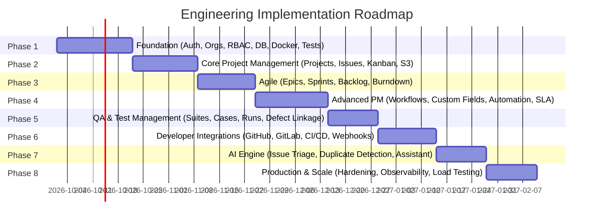

# Enterprise Phased Implementation Plan & Engineering Roadmap

**Project:** Enterprise AI-Powered Bug Tracker & Engineering Project Management SaaS  
**Document Version:** 1.0.0  
**Target Completion:** Phased Production Rollout  

---

## 1. Phased Development Roadmap (Phases 1 to 8)

The engineering execution is structured into 8 progressive, decoupled phases. Each phase builds strictly upon the verified foundation of preceding phases, maintaining zero regression of existing functionality.



---

### PHASE 1 — Foundation (Immediate Target Scope)
*Objective: Transform the single-tenant prototype into a hardened multi-tenant SaaS foundation with real identity, authorization, PostgreSQL, and automated testing infrastructure.*

1. **Authentication:**
   - Registration flow with email verification.
   - Login, logout, session persistence via NextAuth v5 JWT cookies.
   - Password reset workflow with time-limited crypto tokens.
   - Active OAuth provider configuration (GitHub & Google).
2. **Organizations & Multi-Tenancy:**
   - Organization creation with unique slug generation and validation.
   - Organization switcher and cookie/header tenant context resolution.
   - Strict tenant data isolation at database and application middleware layers.
3. **Users & Teams:**
   - User profile management and avatar configuration.
   - Functional team creation, editing, and deletion.
   - Team membership management and team lead assignment.
4. **RBAC & Authorization:**
   - Role definition: `OWNER`, `ADMIN`, `MEMBER`, `GUEST`.
   - Granular permission matrix (`org:manage`, `projects:create`, `issues:delete`, etc.).
   - Route middleware guards and Server Action authorization wrappers.
5. **Database Foundation:**
   - PostgreSQL 16 migration with Prisma ORM.
   - Baseline migration tracking (`prisma/migrations`).
   - Removal of `dev.db` from repository tracking.
6. **API Foundation & OpenAPI Contract:**
   - RESTful API framework under `/api/v1/` with standardized JSON response envelopes.
   - Zod validation schemas for all request payloads and query parameters.
   - Auto-generated Swagger / OpenAPI 3.0 documentation (`/api/v1/docs`).
7. **Infrastructure & Environment:**
   - Local Docker Compose stack: PostgreSQL 16, Redis 7, MinIO S3.
   - Environment variable validation using Zod.
   - Multi-stage production Dockerfile.
8. **Logging & Error Handling:**
   - Structured JSON logging (Pino).
   - Global exception handler returning standardized error envelopes.
9. **Testing Foundation:**
   - Setup Vitest, React Testing Library, and Playwright.
   - Automated test harness against a test PostgreSQL database.

---

### PHASE 2 — Core Project Management
*Objective: Upgrade Projects, Issues, Comments, Attachments, and Kanban boards with tenant isolation and real-time state.*

1. **Projects:**
   - Tenant-scoped project creation with unique uppercase key prefixes (e.g., `CORE`, `PROD`).
   - Project membership, roles (`MANAGER`, `CONTRIBUTOR`, `VIEWER`), and archiving.
2. **Issues & Bug Tracking:**
   - Defect tracking attributes: Type, Status, Priority, Severity, Module, Reproducibility, Environment.
   - Unique sequential issue key generation (e.g., `CORE-101`).
   - Markdown / Rich-text editor with user mention parsing (`@username`).
3. **Comments & Attachments:**
   - Threaded discussions with edit/delete controls.
   - S3-compatible pre-signed upload URL generator with strict file validation.
4. **Labels & Tagging:**
   - Color-coded organizational labels and multi-tag filtering.
5. **Kanban Boards & Issue Navigator:**
   - Drag-and-drop card reordering powered by TanStack Query optimistic mutations.
   - Paginated tabular navigator with multi-criteria filtering and sorting.
6. **Search:**
   - PostgreSQL full-text search indexing on issue titles and descriptions.

---

### PHASE 3 — Agile
*Objective: Deliver Linear/Jira-grade agile planning capabilities.*

1. **Epics, Stories, Tasks & Subtasks:**
   - 4-level issue hierarchy: Epic -> Story/Task/Bug -> Subtask.
   - Progress bar aggregation on parent issues based on subtask completion.
2. **Backlog Management:**
   - Dedicated backlog view for unscheduled issues with drag-and-drop prioritization.
3. **Sprints & Scrum:**
   - Sprint lifecycle: Planning -> Active -> Completed.
   - Story point estimation using Fibonacci sequences.
   - Velocity tracking, burndown charts, and burnup charts.
4. **Roadmaps:**
   - Interactive timeline/Gantt view mapping Epics and Releases across calendar quarters.

---

### PHASE 4 — Advanced Project Management
*Objective: Provide enterprise configurability, SLA enforcement, and no-code automation.*

1. **Workflows:**
   - Configurable finite-state machines with status transition rules and role permissions.
2. **Custom Fields:**
   - Dynamic custom fields (Text, Number, Dropdown, Date, User) stored as JSONB.
3. **Automation Engine:**
   - No-code Trigger-Condition-Action pipeline executed asynchronously via BullMQ.
4. **SLA Management:**
   - Response and resolution time countdowns for critical defects with alert webhooks.
5. **Time Tracking:**
   - Worklog entries, time remaining estimates, and exportable timesheets.
6. **Dashboards & Releases:**
   - Custom executive widgets and release version management (`v1.0.0`, changelog notes).

---

### PHASE 5 — QA & Test Management
*Objective: Integrated quality assurance test cycles linked directly to defects.*

1. **Test Suites & Cases:**
   - Test repository with preconditions, step-by-step instructions, and expected results.
2. **Test Runs & Execution:**
   - Test execution runs tracking Passed, Failed, Blocked, and Skipped states.
3. **Defect Linkage:**
   - One-click bug generation from failed test steps with pre-filled reproduction data.
4. **QA Analytics:**
   - Test pass rates, flaky test detection, and requirement test coverage matrices.

---

### PHASE 6 — Developer Integrations
*Objective: Seamless integration with git providers, CI/CD, and external platforms.*

1. **Git Provider Sync:**
   - Bidirectional integration with GitHub, GitLab, and Bitbucket.
   - Automatic issue status transitions from commit messages (e.g. `Fixes CORE-101`) and PR merges.
2. **CI/CD & Deployment Tracking:**
   - Build status monitoring and deployment environment tracking (Staging, Production).
3. **Webhooks:**
   - Inbound webhook receiver with HMAC signature verification.
   - Outbound webhook engine with exponential backoff retries via BullMQ.

---

### PHASE 7 — AI-Powered Capabilities
*Objective: Safe, assistive intelligence with human-in-the-loop confirmation.*

1. **AI Issue Creation & Summarization:**
   - Parse crash dumps, logs, and stack traces into structured bug reports.
2. **Duplicate Detection:**
   - Vector similarity search (pgvector) to detect duplicate tickets upon entry.
3. **Priority & Assignee Recommendations:**
   - Intelligent suggestions requiring explicit user confirmation before applying.
4. **Sprint & Release Risk Analysis:**
   - LLM analysis of sprint backlog velocity and release blockers.

---

### PHASE 8 — Production & Hyper-Scale
*Objective: Enterprise reliability, security compliance, and high concurrency.*

1. **Security Hardening:**
   - SOC2 audit readiness, SAML 2.0 / Okta SSO integration, and secret rotation routines.
2. **Performance Optimization & Caching:**
   - Multi-tier Redis caching, database read replicas, and query optimization.
3. **Observability & Monitoring:**
   - Prometheus metrics, OpenTelemetry distributed tracing, and Sentry error monitoring.
4. **Disaster Recovery:**
   - Automated point-in-time PostgreSQL recovery and multi-region replication.

---

## 2. Phase 1 Acceptance Criteria

Before Phase 1 is deemed complete, all 16 foundational requirements must be validated via automated tests and functional verification:

```
[Phase 1 Acceptance Criteria Checklist]
├── [AC-01] User Registration: New user can register with email and password, with strict Zod validation.
├── [AC-02] Authentication: User can log in securely via credentials and receive a signed JWT session cookie.
├── [AC-03] Session Termination: User can log out and invalidate active session tokens immediately.
├── [AC-04] Password Reset: User can initiate password recovery and receive a time-limited crypto reset token.
├── [AC-05] OAuth Compatibility: NextAuth configured to support GitHub and Google OAuth authentication.
├── [AC-06] Organization Provisioning: Authenticated user can create an Organization with a unique slug.
├── [AC-07] Tenant Ownership: Creating user is automatically granted OWNER role in the created organization.
├── [AC-08] Team Invitation: Organization OWNER/ADMIN can invite another user by email with an assigned role.
├── [AC-09] Invitation Acceptance: Invited user can accept invitation via token and join organization memberships.
├── [AC-10] Team Management: Organization admins can create, rename, and archive functional squads/teams.
├── [AC-11] Team Membership: Users can be added to and removed from specific teams.
├── [AC-12] Role Assignment: Admins can update member roles (OWNER, ADMIN, MEMBER, GUEST).
├── [AC-13] RBAC Enforcement: Unauthorized actions are blocked based on the granular permissions matrix.
├── [AC-14] Protected API Access: All `/api/v1/*` endpoints reject unauthenticated requests with 401 Unauthorized.
├── [AC-15] Tenant Isolation: User in Org A cannot read or mutate Org B resources (returning 403 or 404).
└── [AC-16] Standard Error Responses: Unauthorized/forbidden requests return standardized JSON envelopes.
```

*Every criterion must execute against real PostgreSQL database records. Mock data is strictly prohibited.*

---

## 3. Comprehensive Testing Strategy

A production-grade SaaS requires automated, multi-tiered test coverage. Features are not complete until verified by code.

```
       ▲
      / \     E2E Tests (Playwright)
     /   \    Cross-tenant isolation, user journeys, login flows
    /-----\
   /       \   API & Integration Tests (Vitest + Supertest)
  /         \  RBAC guards, database transactions, webhook retries
 /-----------\
/             \ Unit Tests (Vitest)
/               \ Business logic, validation schemas, utility functions
-----------------
```

### 3.1 Unit Testing Strategy
- **Runner:** Vitest.
- **Scope:** Pure business logic, Zod validation schemas, utility formatters, permission calculation algorithms, and state machines.
- **Target:** > 85% line coverage on domain service calculations.

### 3.2 Integration & API Testing Strategy
- **Runner:** Vitest against a live test PostgreSQL database container.
- **Scope:**
  - All `/api/v1/*` REST endpoints tested for 200, 400, 401, 403, and 404 responses.
  - Verification of Prisma transactions, foreign key cascades, and soft-deletion filters.
  - Validation of query pagination and filtering logic.

### 3.3 Tenant Isolation & Security Testing
- **Multi-Tenant Matrix Test:** Automated test creating two isolated organizations (`Org_Alpha` and `Org_Beta`), asserting that:
  - User from `Org_Alpha` cannot read projects, issues, or teams in `Org_Beta`.
  - Spoofed `organizationId` query parameters are rejected by middleware.
  - Direct database queries through the tenant extension prevent cross-tenant data leakage.
- **RBAC Matrix Test:** Automated tests asserting that GUEST users cannot delete issues or invite members, and MEMBER users cannot alter organization billing or roles.

### 3.4 End-to-End (E2E) Testing Strategy
- **Runner:** Playwright.
- **Scope:**
  - Full authentication lifecycle (Registration -> Login -> Org Creation -> Invite -> Switch Org).
  - Project creation -> Issue creation -> Kanban move -> Comment posting -> Real-time status update.

### 3.5 Performance & Load Testing
- **Tool:** k6.
- **Thresholds:**
  - 95% of Kanban board API requests respond in `< 150ms` at 200 concurrent users.
  - Issue creation endpoint handles 100 requests/sec with zero data corruption.

---

## 4. Risk Analysis & Mitigation Matrix

| Risk Domain | Identified Risk | Severity | Recommended Mitigation |
| :--- | :--- | :---: | :--- |
| **Architecture Risks** | Premature microservices leading to high operational friction and distributed transaction failures. | 🔴 High | Adhere strictly to the **Modular Monolith** pattern. Keep domain modules isolated within the repository; extract to separate services only when specific horizontal scaling needs dictate. |
| **Security Risks** | Cross-tenant data leakage via missing `organizationId` filter in custom queries. | 🔴 Critical | Implement a **Prisma Client Extension** that automatically injects tenant boundaries into all query operations, supplemented by automated multi-tenant isolation unit tests. |
| **Security Risks** | Brute-force credential stuffing and DoS attacks on authentication endpoints. | 🔴 High | Deploy Redis-backed rate limiting using sliding window algorithms (e.g. max 5 login attempts per minute per IP) with temporary account lockout. |
| **Scalability Risks** | PostgreSQL database connection starvation under high serverless concurrency. | 🟠 Medium | Deploy connection pooling (Prisma Accelerate or PgBouncer) and enforce connection pooling limits in `DATABASE_URL`. |
| **Data Integrity Risks** | Race conditions during sequential issue key generation (e.g. `CORE-101`). | 🟠 Medium | Use PostgreSQL atomic sequence generators or database row locks (`SELECT ... FOR UPDATE`) within Prisma transactions for issue key assignment. |
| **Performance Risks** | Degradation of Kanban board queries as issue volume scales into millions. | 🟠 Medium | Enforce composite B-tree indexes on `[organizationId, projectId, statusId]` and mandate cursor-based pagination for large datasets. |
| **Development Risks** | Disruption or loss of existing MVP features during migration to PostgreSQL. | 🟡 Medium | Keep the existing UI components and actions intact while refactoring the data layer underneath; verify with automated regression test suites. |

---

## 5. Architectural Guardrails (Do Not Implement Full Product Yet)

In accordance with strict architecture governance:
- **Phases 2 through 8 are deferred.**
- No fake/mock implementations for future features shall be added.
- No application code changes beyond Phase 1 foundation shall be executed until Phase 1 acceptance criteria and testing strategies are signed off.
